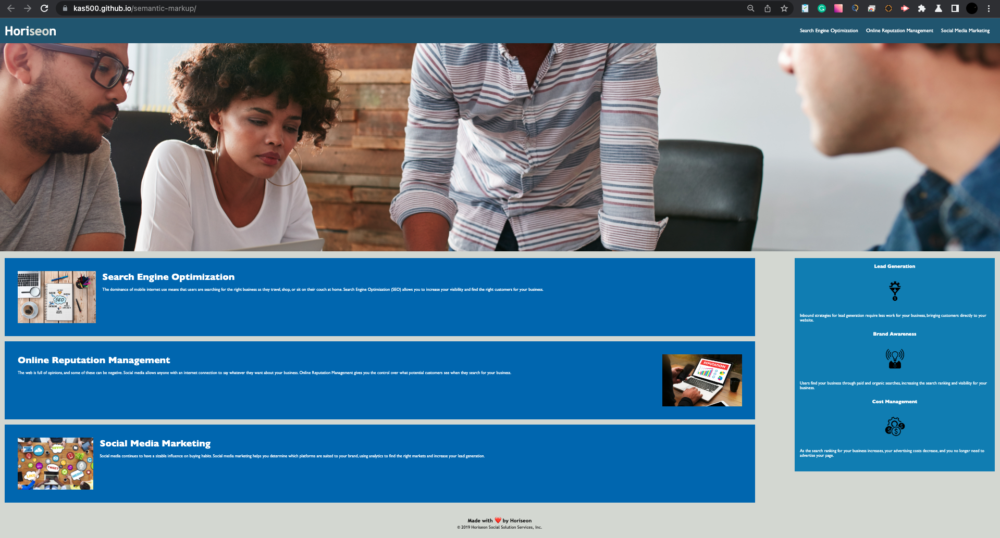

# Semantic markup project. Homework 1

## Description

There are close to 8 billion people in the world. According to World Health Organization, there are over one billion people with disabilities. That is about 15 % of the population. Access to information is a human right. As web developers, we often think that what can be used, accessed and understood by us, also is good enough for others.  **The main goal of this project is to study the basic principles of using the semantic elements of the HTML.** 
## Installation

N/A

## Usage

Due to the fact that the implementation of this project does not involve visual changes to the original web interface, the main use is to view the refactored source code.

To view the source code of the project, you need to open the project by clicking on the link https://kas500.github.io/semantic-markup/ (preferably use Chrome Dev to view it) and use the keyboard shortcut "command + option + C" (Control + Shift + C for Windows users) to inspect a Source code with the integrated Developer tools

## Project web interface

## Chrome Developer tools

## Credits

N/A

## License

MIT License